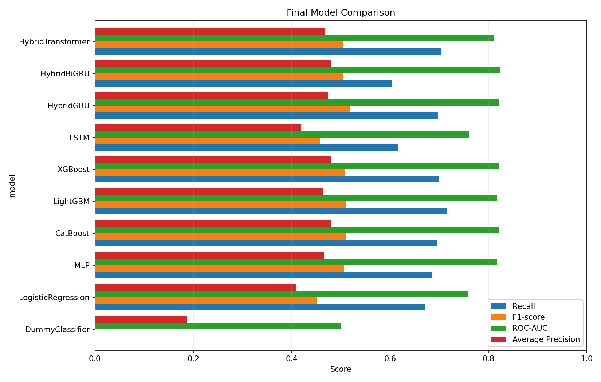
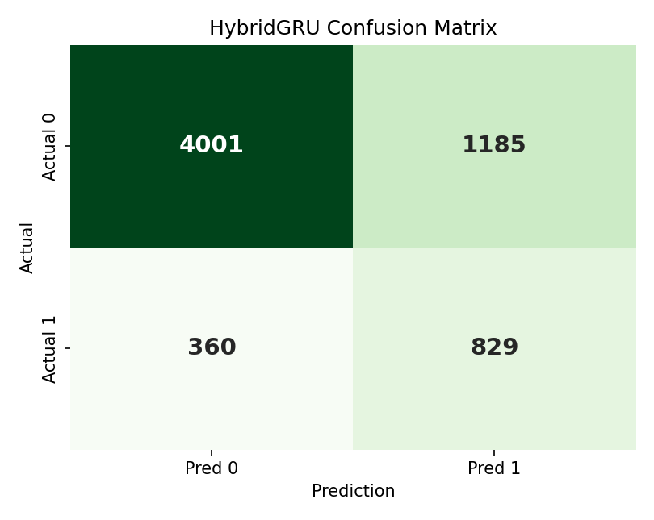
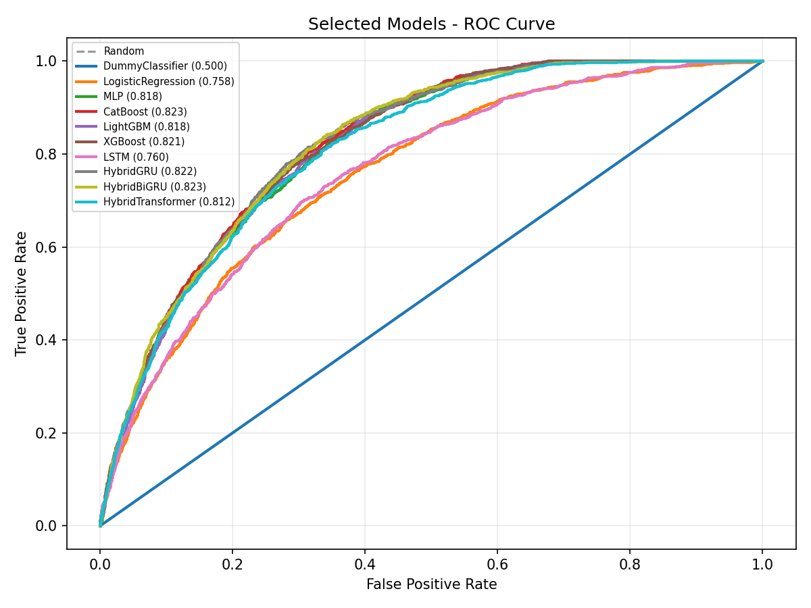
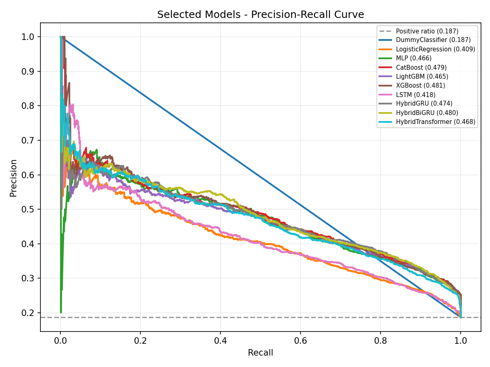

# 고빈도 고객의 재구매 지연 위험 예측

**Repurchase Delay Risk Prediction with Instacart**

Instacart 주문 이력을 사용해 **고빈도 고객의 다음 주문이 지연될 위험**을 예측한 딥러닝 응용 프로젝트입니다.
단순히 고객을 분류하는 것이 아니라, **target 주문 이전의 과거 주문 이력만으로 다음 주문의 지연 위험을 예측**하는 구조를 목표로 했습니다.

최종 발표에서는 tabular baseline, sequence-only deep learning, hybrid deep learning을 비교했고, 최종 딥러닝 후보로 **HybridGRU**를 선정했습니다.

## 프로젝트 한 줄 요약

고빈도 고객의 과거 주문 패턴을 바탕으로, 다음 주문이 15일을 초과해 늦어질 가능성을 예측하고 고객 유지 전략의 우선순위를 정하는 모델을 만들었습니다.

## 바로 보기

- [최종 발표자료 PDF](./presentation/딥러닝_프로젝트_발표자료_이민성팀.pdf)
- [최종 프로젝트 요약](./docs/final_project_summary.md)
- [모델 설계 피드백과 개선안](./docs/model_design_feedback.md)
- [최종 모델 비교 결과](./results/final_model_comparison.csv)
- [전처리 요약](./docs/preprocessing_summary.md)

## 핵심 성과 요약

| 항목 | 내용 |
| --- | --- |
| 문제 유형 | 고빈도 고객의 다음 주문 지연 위험 이진 분류 |
| 최종 모델링 샘플 | 42,499명 |
| 양성 클래스 비율 | 18.65% |
| 비교 범위 | tabular baseline, sequence-only, hybrid deep learning 총 19개 모델/설정 |
| 최종 딥러닝 후보 | HybridGRU |
| HybridGRU 성능 | Precision 0.4116 / Recall 0.6972 / F1 0.5176 / ROC-AUC 0.8220 |
| 운영 관점 해석 | 위험 예측 고객군의 실제 지연 고객 밀도가 전체 평균 대비 약 2.2배 |

## 프로젝트에서 수행한 작업

- Instacart 주문 이력을 이용해 `target_gap > 15` 기반의 재구매 지연 위험 label을 정의했습니다.
- target 주문 이전 이력만 feature로 사용해 feature-label 시점 분리를 유지했습니다.
- 고객 요약 feature 기반 tabular baseline과 최근 주문 sequence 기반 딥러닝 모델을 모두 비교했습니다.
- GRU branch와 MLP branch를 결합한 HybridGRU를 구현해 sequence-only 모델 대비 개선 여부를 확인했습니다.
- ROC/PR curve, confusion matrix, threshold sensitivity, 오류 분석, feature importance를 함께 정리했습니다.
- 최종 발표 이후 교수님 피드백을 반영해 auxiliary-loss HybridGRU 개선 방향까지 문서화했습니다.

## 1. 문제 배경

온라인 장보기 서비스에서 반복 구매가 많은 고객은 고가치 고객일 가능성이 높습니다. 이런 고객의 주문 간격이 길어지는 것은 구매 빈도 감소나 장기 미구매의 초기 신호로 볼 수 있습니다.

이 프로젝트의 목표는 다음과 같습니다.

> 고빈도 고객의 과거 주문 이력을 사용해, 다음 주문이 평소보다 늦어질 위험을 미리 예측할 수 있는가?

모델의 출력은 고객별 `delay_risk score`이며, 실제 활용 관점에서는 쿠폰, 알림, 추천 캠페인처럼 비용이 드는 고객 유지 전략을 **누구에게 먼저 적용할지** 정하는 데 사용할 수 있습니다.

## 2. 데이터셋

사용한 데이터는 Instacart 공개 주문 데이터입니다. Instacart는 미국 온라인 장보기 서비스이며, 데이터에는 고객별 주문 순서, 주문 요일, 주문 시간, 직전 주문 이후 경과일이 포함되어 있습니다.

| 항목 | 값 |
| --- | ---: |
| 전체 고객 수 | 206,209명 |
| 전체 주문 수 | 3,421,083건 |
| 최종 모델링 샘플 수 | 42,499명 |
| 고빈도 고객 기준 | 총 주문 횟수 상위 20% |
| 실제 threshold | 24회 |
| positive ratio | 18.65% |

현재 저장소의 기준 데이터는 [`model_base_hv.csv`](./model_base_hv.csv)입니다. 같은 데이터를 확인하기 위한 보조 파일로 [`model_base_hv.xlsx`](./model_base_hv.xlsx)도 포함했습니다.

`model_base_hv.csv`는 팀원이 Instacart 원본 주문 데이터를 SQL 기반으로 전처리해 만든 모델링용 테이블입니다. 원본 전처리 흐름과 초기 문제 정의는 아래 저장소에서 확인할 수 있습니다.

- Preprocessing reference: [dlwogud/High-Value-Customer-Churn-Prediction](https://github.com/dlwogud/High-Value-Customer-Churn-Prediction)

이 저장소에서는 위 전처리 결과를 출발점으로 삼아, 최종 모델링 데이터 기준의 라벨 분위수를 다시 확인하고 tabular baseline, sequence-only deep learning, hybrid deep learning 실험을 확장했습니다. 따라서 라벨 기준과 최종 성능 해석은 본 저장소의 `model_base_hv.csv` 재집계 결과를 기준으로 합니다.

## 3. 예측 문제 정의

이 프로젝트에서 가장 중요한 설계 원칙은 **feature와 label의 시점 분리**입니다.

```text
target 이전 주문 이력  ->  feature 생성
target 주문의 실제 gap ->  label 생성
```

예를 들어 어떤 고객의 25번째 주문을 target으로 둔다면, 모델은 24번째 주문까지의 기록만 보고 25번째 주문이 지연될지 예측합니다.
`target_gap`은 모델 입력 변수가 아니라 정답 label을 만들기 위한 변수입니다.

## 4. 타깃 정의

최종 라벨은 다음과 같이 정의했습니다.

```text
target_gap > 15  ->  delay_risk = 1
target_gap <= 15 ->  delay_risk = 0
```

현재 최종 모델링 데이터에서 `target_gap` 분위수는 아래와 같습니다.

| 분위수 | 일수 | 해석 |
| --- | ---: | --- |
| q80 | 15일 | 약 80%의 target_gap이 15일 이하 |
| q90 | 24일 | 더 엄격한 고위험 기준 후보 |
| q95 | 30일 | 매우 긴 지연 구간 |

따라서 15일 기준은 q90 기준이 아니라, **q80 수준의 조기 탐지 기준**입니다. q90인 24일 기준은 별도의 민감도 분석 대상으로 두었습니다.

## 5. 입력 feature 구성

두 종류의 입력을 사용했습니다.

### 고객 요약 feature

target 주문 이전 이력을 하나의 벡터로 요약한 feature입니다.

| feature 예시 | 의미 |
| --- | --- |
| `total_orders_before_target` | target 이전 주문 수 |
| `avg_gap_before_target` | 평균 주문 간격 |
| `recent_3_avg_gap` | 최근 3회 주문 간격 평균 |
| `recent_5_avg_gap` | 최근 5회 주문 간격 평균 |
| `last_gap_before_target` | target 직전 주문 간격 |
| `gap_trend` | 최근 주문 간격 변화 추세 |
| `active_span_days` | target 이전 고객 활동 기간 |
| `weekend_order_ratio` | 주말 주문 비율 |

### 주문 sequence 입력

최근 20개 주문을 순서대로 사용했습니다.

| sequence 설정 | 내용 |
| --- | --- |
| sequence length | 최근 20개 주문 |
| per-order features | gap, gap_delta, 최근 3회 gap 평균 |
| time encoding | 주문 요일/시간의 sin, cos 변환 |
| relative position | target 이전 주문 내 상대적 위치 |

요약 feature는 고객의 장기 구매 성향을 잘 보여주고, sequence 입력은 주문 간격이 어떤 순서로 변했는지를 직접 보여줍니다.

## 6. 실험 설계

세 그룹의 모델을 비교했습니다.

| 모델군 | 사용 모델 | 실험 목적 |
| --- | --- | --- |
| Tabular baseline | DummyClassifier, LogisticRegression, MLP, CatBoost, LightGBM, XGBoost | 고객 요약 feature만으로 어느 정도 예측 가능한지 확인 |
| Sequence-only deep learning | LSTM, GRU, BiGRU, TCN, TransformerEncoder | 최근 주문 sequence만으로 예측 가능한지 확인 |
| Hybrid deep learning | HybridLSTM, HybridGRU, HybridBiGRU, HybridTCN, HybridTransformer | 고객 요약 feature와 sequence 정보를 결합했을 때 개선되는지 확인 |

split은 `train / validation / test = 70 / 15 / 15`입니다.

| split | 샘플 수 | 용도 |
| --- | ---: | --- |
| train | 29,749 | 모델 학습 |
| validation | 6,375 | threshold tuning 및 모델 선택 |
| test | 6,375 | 최종 성능 평가 |

현재 데이터는 사용자당 1행이므로 같은 고객이 여러 split에 동시에 들어가지 않습니다. 다만 실제 서비스 적용을 위해서는 시간 기준 검증이 더 엄격합니다.

## 7. 평가 지표

positive class 비율이 18.65%인 불균형 데이터이므로 accuracy만으로 평가하지 않았습니다.

| 지표 | 사용 이유 |
| --- | --- |
| Recall | 실제 지연 고객을 얼마나 놓치지 않는지 확인 |
| Precision | 위험으로 예측한 고객 중 실제 지연 고객 비율 확인 |
| F1-score | Precision과 Recall의 균형 확인 |
| ROC-AUC | threshold 전반의 구분 능력 확인 |
| Average Precision | positive class가 적을 때 ranking 품질 확인 |

모델별 decision threshold는 validation set에서 F1-score가 가장 높아지는 기준으로 선택했습니다.

## 8. 최종 결과

최종 비교 결과는 [`results/final_model_comparison.csv`](./results/final_model_comparison.csv)에 정리했습니다.

| model | precision | recall | f1_score | roc_auc | average_precision |
| --- | ---: | ---: | ---: | ---: | ---: |
| HybridGRU | 0.4116 | 0.6972 | 0.5176 | 0.8220 | 0.4737 |
| CatBoost | 0.4035 | 0.6947 | 0.5105 | 0.8226 | 0.4795 |
| LightGBM | 0.3958 | 0.7157 | 0.5097 | 0.8181 | 0.4649 |
| XGBoost | 0.3990 | 0.6997 | 0.5082 | 0.8209 | 0.4807 |
| MLP | 0.4012 | 0.6863 | 0.5064 | 0.8179 | 0.4663 |
| LSTM | 0.3626 | 0.6173 | 0.4569 | 0.7604 | 0.4179 |



### 지표별 해석

- `HybridGRU`: F1-score 기준 가장 높은 균형 성능
- `LightGBM`: Recall 기준 가장 많은 지연 고객 탐지
- `XGBoost`: Average Precision 기준 positive class ranking 강점
- `CatBoost`: ROC-AUC와 F1에서 매우 경쟁력 있는 tabular baseline
- `LSTM`: sequence-only deep learning 기준점

HybridGRU가 모든 지표에서 압도적으로 우수한 것은 아닙니다. 다만 이번 프로젝트의 핵심 가설인 **고객 요약 feature와 최근 주문 sequence의 결합**을 가장 직접적으로 구현했고, F1-score 기준 가장 균형적인 결과를 보였습니다.

## 9. HybridGRU 해석

HybridGRU는 다음 두 branch를 결합합니다.

```text
최근 주문 sequence -> GRU encoder -> sequence embedding
고객 요약 feature -> MLP encoder -> tabular embedding
sequence embedding + tabular embedding -> final delay_risk score
```

sequence-only 최고 모델인 LSTM의 F1-score는 0.4569였고, HybridGRU의 F1-score는 0.5176이었습니다.
즉 최근 주문 흐름만 보는 것보다, 고객 요약 feature를 함께 보는 것이 더 나은 결과를 보였습니다.

## 10. Confusion Matrix와 운영 관점 해석

test set에서 실제 지연 고객은 1,189명이었고, HybridGRU는 그중 829명을 탐지했습니다.

```text
Recall = 829 / 1,189 = 0.6972
```



Precision은 0.4116입니다. 단독으로 보면 낮아 보일 수 있지만, 전체 지연 고객 비율이 18.65%라는 점을 함께 봐야 합니다.

```text
0.4116 / 0.1865 ≈ 2.2
```

즉 모델이 위험하다고 고른 고객군에는 실제 지연 고객이 평균보다 약 2.2배 더 많이 포함되어 있었습니다. 이 결과는 완성된 운영 모델이라기보다, **고객 유지 전략 후보를 우선순위화하는 risk score 모델**로 해석했습니다.

## 11. 추가 분석

최종 결과 외에도 아래 분석을 수행했습니다.

| 분석 | 파일 |
| --- | --- |
| q80/q90 라벨 기준 민감도 분석 | [`results/delay_threshold_sensitivity_summary.md`](./results/delay_threshold_sensitivity_summary.md) |
| q90 HybridGRU sensitivity | [`results/q90_hybridgru_sensitivity_summary.md`](./results/q90_hybridgru_sensitivity_summary.md) |
| HybridGRU 오류 분석 | [`results/hybridgru_error_analysis_summary.md`](./results/hybridgru_error_analysis_summary.md) |
| feature importance | [`results/feature_importance_mlp.csv`](./results/feature_importance_mlp.csv) |
| feature ablation | [`results/feature_ablation_summary.md`](./results/feature_ablation_summary.md) |

ROC curve와 PR curve도 함께 저장했습니다.





## 12. 한계와 개선 방향

현재 프로젝트의 한계는 아래와 같습니다.

- 현재 split은 stratified random split이다. 실제 서비스 적용에는 시간 기준 검증이 더 엄격하다.
- `target_gap > 15`는 q80 기반의 조기 탐지 기준이다. 고객별 구매 주기를 반영한 개인화 기준은 추가 실험이 필요하다.
- 현재 HybridGRU는 최종 fusion output 하나에 대해서만 loss를 계산하는 single-loss late fusion 구조다.
- Instacart에는 상품 정보도 있지만, 이번 프로젝트는 주문 간격과 주문 순서 정보에 집중했다.

발표 후 받은 모델 설계 피드백을 반영하면, GRU branch와 MLP branch 각각에 보조 prediction head와 auxiliary loss를 추가하는 구조가 더 엄밀합니다. 자세한 내용은 [`docs/model_design_feedback.md`](./docs/model_design_feedback.md)에 정리했습니다.

## 13. 실행 방법

```bash
pip install -r requirements.txt
```

주요 실행 순서는 아래와 같습니다.

```bash
python train_tabular_baselines.py
python train_deep_sequence_models.py
python train_hybrid_deep_models.py
python summarize_final_model_results.py
python analyze_hybridgru_errors.py
```

| 실행 파일 | 주요 산출물 |
| --- | --- |
| `train_tabular_baselines.py` | `results/tabular_model_comparison.csv`, `results/tabular_roc_curve.png`, `results/tabular_pr_curve.png` |
| `train_deep_sequence_models.py` | `results/deep_sequence_model_comparison.csv`, `results/deep_sequence_model_summary.md` |
| `train_hybrid_deep_models.py` | `results/hybrid_deep_model_comparison.csv`, `results/hybrid_deep_model_summary.md` |
| `summarize_final_model_results.py` | `results/final_model_comparison.csv`, `results/final_model_comparison.png` |
| `analyze_hybridgru_errors.py` | `results/hybridgru_error_analysis_summary.md`, `results/final_hybridgru_confusion_matrix.png` |
| `sensitivity_delay_threshold.py` | `results/delay_threshold_sensitivity.csv`, `results/delay_threshold_sensitivity_summary.md` |

노트북 설명은 [`notebooks/`](./notebooks/) 폴더에서 확인할 수 있습니다.

## 14. 저장소 구조

```text
.
|-- README.md
|-- requirements.txt
|-- model_base_hv.csv
|-- model_base_hv.xlsx
|-- train_tabular_baselines.py
|-- train_deep_sequence_models.py
|-- train_hybrid_deep_models.py
|-- summarize_final_model_results.py
|-- analyze_hybridgru_errors.py
|-- sensitivity_delay_threshold.py
|-- notebooks/
|   |-- 01_prepare_data.ipynb
|   |-- 02_train_mlp.ipynb
|   |-- 03_train_lstm.ipynb
|   `-- 04_compare_models.ipynb
|-- docs/
|   |-- final_project_summary.md
|   |-- preprocessing_summary.md
|   |-- model_design_feedback.md
|   `-- github_upload_checklist.md
|-- results/
|   |-- final_model_comparison.csv
|   |-- final_model_comparison.png
|   |-- final_selected_roc_curve.png
|   |-- final_selected_pr_curve.png
|   `-- final_hybridgru_confusion_matrix.png
`-- presentation/
    |-- 딥러닝_프로젝트_발표자료_이민성팀.pdf
    |-- final_repurchase_delay_presentation_v14.pptx
    `-- final_presentation_speaker_script_v14.docx
```

## 15. 프로젝트를 통해 확인한 점

이 프로젝트에서 가장 중요했던 점은 단순히 모델 하나의 성능을 높이는 것이 아니라, **문제 정의, feature-label 시점 분리, baseline 비교, sequence 모델 확장, hybrid 모델 비교, 오류 분석**까지 하나의 예측 프로젝트 흐름으로 연결한 것입니다.

최종적으로 HybridGRU는 압도적인 우위를 보인 모델은 아니지만, 고빈도 고객의 장기 구매 성향과 최근 주문 흐름을 함께 보는 구조가 sequence-only 모델보다 더 효과적일 수 있음을 확인했습니다.
